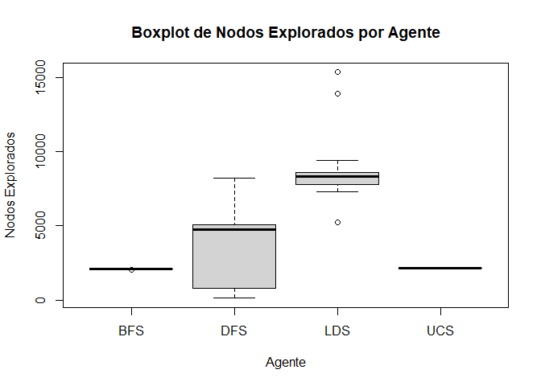

# **Inteligencia Artificial I**

## **UNCuyo - Facultad de Ingeniería**

## **Trabajo Práctico 3 - Búsqueda no informada.**

**Resultados de los agentes:**

-   **Agente BFS**:

Media: 3381.233

Desviación estándar: 27.63148

Cuadro total:

|Agente|Nodos explorados|Numero de enviroment|Solución encontrada|
|------|----------------|--------------------|-------------------|
|BFS   |2083            |0                   |True               |
|BFS   |2088            |1                   |True               |
|BFS   |2113            |2                   |True               |
|BFS   |2066            |3                   |True               |
|BFS   |2083            |4                   |True               |
|BFS   |2087            |5                   |True               |
|BFS   |2121            |6                   |True               |
|BFS   |2129            |7                   |True               |
|BFS   |2100            |8                   |True               |
|BFS   |2122            |9                   |True               |
|BFS   |2108            |10                  |True               |
|BFS   |2098            |11                  |True               |
|BFS   |2119            |12                  |True               |
|BFS   |2088            |13                  |True               |
|BFS   |2132            |14                  |True               |
|BFS   |2078            |15                  |True               |
|BFS   |2076            |16                  |True               |
|BFS   |2133            |17                  |True               |
|BFS   |2129            |18                  |True               |
|BFS   |2074            |19                  |True               |
|BFS   |2017            |20                  |True               |
|BFS   |2105            |21                  |True               |
|BFS   |2123            |22                  |True               |
|BFS   |2073            |23                  |True               |
|BFS   |2034            |24                  |True               |
|BFS   |2116            |25                  |True               |
|BFS   |2110            |26                  |True               |
|BFS   |2089            |27                  |True               |
|BFS   |2093            |28                  |True               |
|BFS   |2079            |29                  |True               |

-   **Agente DFS:**

Media: 3786.233

Desviación estándar: 2266.331

Cuadro total:

|Agente|Nodos explorados|Numero de enviroment|Solución encontrada|
|------|----------------|--------------------|-------------------|
|DFS   |5405            |0                   |True               |
|DFS   |404             |1                   |True               |
|DFS   |5484            |2                   |True               |
|DFS   |4769            |3                   |True               |
|DFS   |191             |4                   |True               |
|DFS   |8199            |5                   |True               |
|DFS   |5254            |6                   |True               |
|DFS   |5280            |7                   |True               |
|DFS   |193             |8                   |True               |
|DFS   |4937            |9                   |True               |
|DFS   |126             |10                  |True               |
|DFS   |211             |11                  |True               |
|DFS   |4776            |12                  |True               |
|DFS   |4932            |13                  |True               |
|DFS   |4832            |14                  |True               |
|DFS   |4278            |15                  |True               |
|DFS   |4802            |16                  |True               |
|DFS   |6092            |17                  |True               |
|DFS   |5381            |18                  |True               |
|DFS   |5051            |19                  |True               |
|DFS   |809             |20                  |True               |
|DFS   |4258            |21                  |True               |
|DFS   |4996            |22                  |True               |
|DFS   |5055            |23                  |True               |
|DFS   |4700            |24                  |True               |
|DFS   |4457            |25                  |True               |
|DFS   |193             |26                  |True               |
|DFS   |177             |27                  |True               |
|DFS   |4024            |28                  |True               |
|DFS   |4321            |29                  |True               |

-   **Agente LDS**:

Media: 8588.733

Desviación estándar: 1826.074

Cuadro total:

|Agente|Nodos explorados|Numero de enviroment|Solución encontrada|
|------|----------------|--------------------|-------------------|
|LDS   |8425            |0                   |True               |
|LDS   |8059            |1                   |True               |
|LDS   |8485            |2                   |True               |
|LDS   |7956            |3                   |True               |
|LDS   |8209            |4                   |True               |
|LDS   |7326            |5                   |True               |
|LDS   |7509            |6                   |True               |
|LDS   |8595            |7                   |True               |
|LDS   |9409            |8                   |True               |
|LDS   |8474            |9                   |True               |
|LDS   |7806            |10                  |True               |
|LDS   |8298            |11                  |True               |
|LDS   |13933           |12                  |True               |
|LDS   |8867            |13                  |True               |
|LDS   |5243            |14                  |True               |
|LDS   |15351           |15                  |True               |
|LDS   |7590            |16                  |True               |
|LDS   |8487            |17                  |True               |
|LDS   |9356            |18                  |True               |
|LDS   |7330            |19                  |True               |
|LDS   |9176            |20                  |True               |
|LDS   |8657            |21                  |True               |
|LDS   |8301            |22                  |True               |
|LDS   |8249            |23                  |True               |
|LDS   |7385            |24                  |True               |
|LDS   |7758            |25                  |True               |
|LDS   |8352            |26                  |True               |
|LDS   |8176            |27                  |True               |
|LDS   |8482            |28                  |True               |
|LDS   |8418            |29                  |True               |

-   **Agente UCS**:

Media: 2145.9

Desviación estándar: 16.28486

Cuadro total:

|Agente|Nodos explorados|Numero de enviroment|Solución encontrada|
|------|----------------|--------------------|-------------------|
|UCS   |2137            |0                   |True               |
|UCS   |2138            |1                   |True               |
|UCS   |2163            |2                   |True               |
|UCS   |2116            |3                   |True               |
|UCS   |2143            |4                   |True               |
|UCS   |2137            |5                   |True               |
|UCS   |2171            |6                   |True               |
|UCS   |2159            |7                   |True               |
|UCS   |2157            |8                   |True               |
|UCS   |2172            |9                   |True               |
|UCS   |2139            |10                  |True               |
|UCS   |2129            |11                  |True               |
|UCS   |2153            |12                  |True               |
|UCS   |2139            |13                  |True               |
|UCS   |2162            |14                  |True               |
|UCS   |2123            |15                  |True               |
|UCS   |2133            |16                  |True               |
|UCS   |2165            |17                  |True               |
|UCS   |2169            |18                  |True               |
|UCS   |2126            |19                  |True               |
|UCS   |2133            |20                  |True               |
|UCS   |2154            |21                  |True               |
|UCS   |2179            |22                  |True               |
|UCS   |2127            |23                  |True               |
|UCS   |2144            |24                  |True               |
|UCS   |2144            |25                  |True               |
|UCS   |2144            |26                  |True               |
|UCS   |2134            |27                  |True               |
|UCS   |2152            |28                  |True               |
|UCS   |2135            |29                  |True               |

### Boxplots:

### Conclusión:

En mi opinión, el algoritmo por BFS es el mejor para la búsqueda del camino óptimo ya que nos garantiza una excelente solución sin explorar demasiados estados ni desperdiciar recursos o tiempo.
