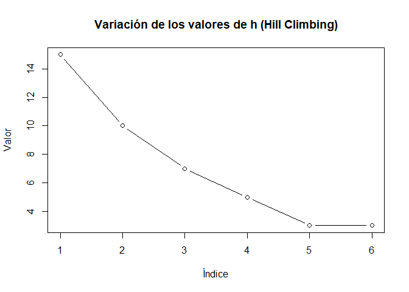
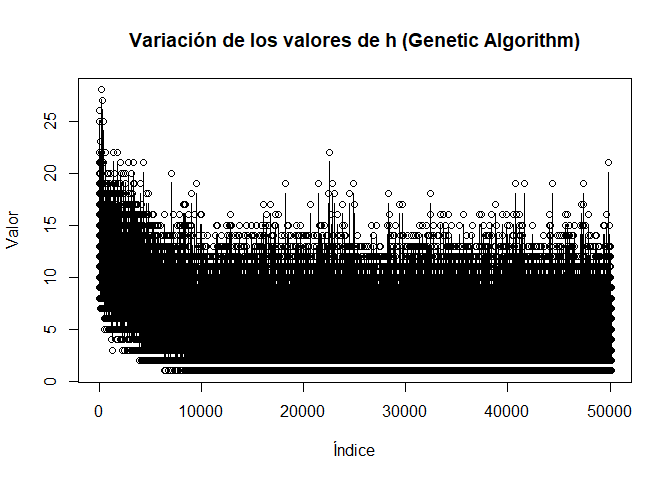

# **Inteligencia Artificial I.**
## **UNCuyo - Facultad de Ingeniería.**
### **Trabajo Práctico 5 - Búsquedas Locales*.*

**Resultados de los algoritmos:**

-   **Hill Climbing**:

    - Porcentaje de veces que encontró la solución final: 14%

    - Media de tiempo de ejecucion: 0.004822159 segundos

    - Desviación estándar del tiempo de ejecucion: 0.006641131 segundos

    - Media de estados explorados: 5.006667

    - Desviación estándar de los estados explorados: 1.961018

    - Variabilidad de los valores de h:
      

|Algoritmo    |Cantidad de reinas|Tiempo de ejecucion  |Numero de soluciones exploradas|Solucion encontrada|
|-------------|------------------|---------------------|-------------------------------|-------------------|
|Hill Climbing|4                 |0.0                  |3                              |True               |
|Hill Climbing|4                 |0.0                  |1                              |False              |
|Hill Climbing|4                 |0.0                  |3                              |False              |
|Hill Climbing|4                 |0.0                  |3                              |False              |
|Hill Climbing|4                 |0.0                  |2                              |False              |
|Hill Climbing|4                 |0.0                  |3                              |False              |
|Hill Climbing|4                 |0.0                  |3                              |True               |
|Hill Climbing|4                 |0.0                  |4                              |True               |
|Hill Climbing|4                 |0.0                  |2                              |False              |
|Hill Climbing|4                 |0.0                  |2                              |False              |
|Hill Climbing|4                 |0.0                  |2                              |False              |
|Hill Climbing|4                 |0.0                  |2                              |True               |
|Hill Climbing|4                 |0.0009996891021728516|2                              |False              |
|Hill Climbing|4                 |0.0                  |2                              |False              |
|Hill Climbing|4                 |0.0                  |2                              |True               |
|Hill Climbing|4                 |0.0                  |3                              |False              |
|Hill Climbing|4                 |0.0                  |2                              |False              |
|Hill Climbing|4                 |0.0                  |2                              |False              |
|Hill Climbing|4                 |0.0                  |1                              |False              |
|Hill Climbing|4                 |0.0                  |4                              |True               |
|Hill Climbing|4                 |0.0                  |3                              |False              |
|Hill Climbing|4                 |0.0                  |3                              |True               |
|Hill Climbing|4                 |0.0                  |3                              |False              |
|Hill Climbing|4                 |0.0                  |2                              |False              |
|Hill Climbing|4                 |0.0                  |1                              |True               |
|Hill Climbing|4                 |0.0                  |2                              |True               |
|Hill Climbing|4                 |0.0                  |3                              |False              |
|Hill Climbing|4                 |0.0                  |4                              |True               |
|Hill Climbing|4                 |0.0                  |3                              |False              |
|Hill Climbing|4                 |0.0                  |2                              |False              |
|Hill Climbing|8                 |0.0009996891021728516|5                              |True               |
|Hill Climbing|8                 |0.0                  |4                              |False              |
|Hill Climbing|8                 |0.0010018348693847656|3                              |False              |
|Hill Climbing|8                 |0.0010001659393310547|5                              |False              |
|Hill Climbing|8                 |0.0009984970092773438|5                              |False              |
|Hill Climbing|8                 |0.0                  |3                              |False              |
|Hill Climbing|8                 |0.0                  |3                              |False              |
|Hill Climbing|8                 |0.0                  |5                              |False              |
|Hill Climbing|8                 |0.0                  |4                              |False              |
|Hill Climbing|8                 |0.0009987354278564453|4                              |False              |
|Hill Climbing|8                 |0.0                  |4                              |False              |
|Hill Climbing|8                 |0.0                  |5                              |False              |
|Hill Climbing|8                 |0.0                  |5                              |True               |
|Hill Climbing|8                 |0.0                  |5                              |False              |
|Hill Climbing|8                 |0.0                  |4                              |False              |
|Hill Climbing|8                 |0.0                  |3                              |False              |
|Hill Climbing|8                 |0.0                  |5                              |False              |
|Hill Climbing|8                 |0.0                  |3                              |False              |
|Hill Climbing|8                 |0.0009980201721191406|5                              |False              |
|Hill Climbing|8                 |0.0                  |4                              |False              |
|Hill Climbing|8                 |0.0010004043579101562|5                              |True               |
|Hill Climbing|8                 |0.0009987354278564453|5                              |False              |
|Hill Climbing|8                 |0.00099945068359375  |4                              |False              |
|Hill Climbing|8                 |0.0009999275207519531|5                              |False              |
|Hill Climbing|8                 |0.0009992122650146484|5                              |False              |
|Hill Climbing|8                 |0.0010006427764892578|4                              |False              |
|Hill Climbing|8                 |0.0                  |5                              |False              |
|Hill Climbing|8                 |0.0                  |4                              |False              |
|Hill Climbing|8                 |0.0                  |5                              |False              |
|Hill Climbing|8                 |0.0                  |5                              |False              |
|Hill Climbing|10                |0.015642166137695312 |4                              |False              |
|Hill Climbing|10                |0.008017301559448242 |5                              |True               |
|Hill Climbing|10                |0.004016876220703125 |4                              |False              |
|Hill Climbing|10                |0.002001047134399414 |4                              |False              |
|Hill Climbing|10                |0.002000570297241211 |4                              |False              |
|Hill Climbing|10                |0.0                  |6                              |False              |
|Hill Climbing|10                |0.015625476837158203 |5                              |False              |
|Hill Climbing|10                |0.0                  |3                              |False              |
|Hill Climbing|10                |0.0                  |5                              |False              |
|Hill Climbing|10                |0.002000093460083008 |5                              |False              |
|Hill Climbing|10                |0.0                  |4                              |False              |
|Hill Climbing|10                |0.0                  |5                              |False              |
|Hill Climbing|10                |0.0                  |4                              |False              |
|Hill Climbing|10                |0.0019998550415039062|5                              |False              |
|Hill Climbing|10                |0.0                  |2                              |False              |
|Hill Climbing|10                |0.0029985904693603516|7                              |False              |
|Hill Climbing|10                |0.0019996166229248047|6                              |False              |
|Hill Climbing|10                |0.0025103092193603516|7                              |True               |
|Hill Climbing|10                |0.0                  |7                              |False              |
|Hill Climbing|10                |0.0                  |4                              |False              |
|Hill Climbing|10                |0.0                  |5                              |False              |
|Hill Climbing|10                |0.0020003318786621094|4                              |False              |
|Hill Climbing|10                |0.0009992122650146484|3                              |False              |
|Hill Climbing|10                |0.0010006427764892578|4                              |False              |
|Hill Climbing|10                |0.003000020980834961 |6                              |False              |
|Hill Climbing|10                |0.0                  |3                              |False              |
|Hill Climbing|10                |0.0029985904693603516|7                              |True               |
|Hill Climbing|10                |0.003000020980834961 |6                              |False              |
|Hill Climbing|10                |0.0019986629486083984|5                              |False              |
|Hill Climbing|10                |0.0020003318786621094|6                              |False              |
|Hill Climbing|12                |0.0                  |4                              |False              |
|Hill Climbing|12                |0.0045087337493896484|5                              |False              |
|Hill Climbing|12                |0.0070002079010009766|8                              |False              |
|Hill Climbing|12                |0.004999637603759766 |6                              |False              |
|Hill Climbing|12                |0.003999948501586914 |5                              |False              |
|Hill Climbing|12                |0.0070002079010009766|8                              |False              |
|Hill Climbing|12                |0.015515804290771484 |6                              |False              |
|Hill Climbing|12                |0.016142845153808594 |8                              |False              |
|Hill Climbing|12                |0.005999326705932617 |6                              |False              |
|Hill Climbing|12                |0.007000446319580078 |7                              |False              |
|Hill Climbing|12                |0.007999658584594727 |9                              |True               |
|Hill Climbing|12                |0.0060007572174072266|7                              |False              |
|Hill Climbing|12                |0.006000041961669922 |7                              |False              |
|Hill Climbing|12                |0.0                  |5                              |False              |
|Hill Climbing|12                |0.0                  |6                              |False              |
|Hill Climbing|12                |0.004999399185180664 |6                              |False              |
|Hill Climbing|12                |0.004000663757324219 |5                              |False              |
|Hill Climbing|12                |0.007000446319580078 |8                              |True               |
|Hill Climbing|12                |0.0156252384185791   |8                              |True               |
|Hill Climbing|12                |0.004999876022338867 |5                              |False              |
|Hill Climbing|12                |0.0                  |6                              |False              |
|Hill Climbing|12                |0.0                  |6                              |False              |
|Hill Climbing|12                |0.003999948501586914 |5                              |False              |
|Hill Climbing|12                |0.005000114440917969 |5                              |False              |
|Hill Climbing|12                |0.006000518798828125 |7                              |False              |
|Hill Climbing|12                |0.0                  |4                              |False              |
|Hill Climbing|12                |0.0                  |5                              |False              |
|Hill Climbing|12                |0.006001949310302734 |6                              |False              |
|Hill Climbing|12                |0.0                  |5                              |False              |
|Hill Climbing|12                |0.004998922348022461 |6                              |False              |
|Hill Climbing|15                |0.011000394821166992 |5                              |False              |
|Hill Climbing|15                |0.014999866485595703 |7                              |False              |
|Hill Climbing|15                |0.018999338150024414 |9                              |True               |
|Hill Climbing|15                |0.016033411026000977 |7                              |False              |
|Hill Climbing|15                |0.016193628311157227 |8                              |False              |
|Hill Climbing|15                |0.018999338150024414 |9                              |False              |
|Hill Climbing|15                |0.015624761581420898 |8                              |False              |
|Hill Climbing|15                |0.01563572883605957  |8                              |False              |
|Hill Climbing|15                |0.015508413314819336 |7                              |False              |
|Hill Climbing|15                |0.014999866485595703 |7                              |False              |
|Hill Climbing|15                |0.01699995994567871  |8                              |False              |
|Hill Climbing|15                |0.01700425148010254  |8                              |False              |
|Hill Climbing|15                |0.0156252384185791   |8                              |False              |
|Hill Climbing|15                |0.018713951110839844 |8                              |True               |
|Hill Climbing|15                |0.013000726699829102 |6                              |False              |
|Hill Climbing|15                |0.015642642974853516 |5                              |False              |
|Hill Climbing|15                |0.015015125274658203 |8                              |False              |
|Hill Climbing|15                |0.015005111694335938 |7                              |False              |
|Hill Climbing|15                |0.03125              |9                              |False              |
|Hill Climbing|15                |0.017000436782836914 |8                              |False              |
|Hill Climbing|15                |0.015999555587768555 |7                              |False              |
|Hill Climbing|15                |0.013000011444091797 |6                              |False              |
|Hill Climbing|15                |0.017510414123535156 |8                              |False              |
|Hill Climbing|15                |0.015702009201049805 |5                              |False              |
|Hill Climbing|15                |0.015798568725585938 |7                              |False              |
|Hill Climbing|15                |0.015000104904174805 |7                              |False              |
|Hill Climbing|15                |0.013799667358398438 |7                              |False              |
|Hill Climbing|15                |0.010999441146850586 |5                              |False              |
|Hill Climbing|15                |0.01565408706665039  |9                              |False              |
|Hill Climbing|15                |0.013008356094360352 |6                              |False              |

-   **Simulated Annealing**:

    - Porcentaje de veces que encontró la solución final: 24%

    - Media del tiempo de ejecucion: 0.0008938583 segundos

    - Desviación estándar del tiempo de ejecucion: 0.002099027 segundos

    - Media de estados explorados: 142

    - Desviación estándar de los estados explorados:] 0

    - Variacion de la función h:

|Algoritmo          |Cantidad de reinas|Tiempo de ejecucion  |Numero de soluciones exploradas|Solucion encontrada|
|-------------------|------------------|---------------------|-------------------------------|-------------------|
|Simulated Annealing|4                 |0.00099945068359375  |142                            |True               |
|Simulated Annealing|4                 |0.0                  |142                            |True               |
|Simulated Annealing|4                 |0.0009999275207519531|142                            |True               |
|Simulated Annealing|4                 |0.0                  |142                            |True               |
|Simulated Annealing|4                 |0.0                  |142                            |True               |
|Simulated Annealing|4                 |0.0009999275207519531|142                            |True               |
|Simulated Annealing|4                 |0.0                  |142                            |True               |
|Simulated Annealing|4                 |0.0                  |142                            |True               |
|Simulated Annealing|4                 |0.0                  |142                            |True               |
|Simulated Annealing|4                 |0.0                  |142                            |True               |
|Simulated Annealing|4                 |0.0                  |142                            |True               |
|Simulated Annealing|4                 |0.0                  |142                            |True               |
|Simulated Annealing|4                 |0.0                  |142                            |True               |
|Simulated Annealing|4                 |0.0009999275207519531|142                            |True               |
|Simulated Annealing|4                 |0.0                  |142                            |True               |
|Simulated Annealing|4                 |0.0009980201721191406|142                            |True               |
|Simulated Annealing|4                 |0.0                  |142                            |True               |
|Simulated Annealing|4                 |0.0010001659393310547|142                            |True               |
|Simulated Annealing|4                 |0.0                  |142                            |True               |
|Simulated Annealing|4                 |0.0                  |142                            |True               |
|Simulated Annealing|4                 |0.0009999275207519531|142                            |True               |
|Simulated Annealing|4                 |0.0                  |142                            |True               |
|Simulated Annealing|4                 |0.0                  |142                            |True               |
|Simulated Annealing|4                 |0.0                  |142                            |False              |
|Simulated Annealing|4                 |0.0010037422180175781|142                            |True               |
|Simulated Annealing|4                 |0.0                  |142                            |True               |
|Simulated Annealing|4                 |0.0                  |142                            |True               |
|Simulated Annealing|4                 |0.0                  |142                            |True               |
|Simulated Annealing|4                 |0.001001119613647461 |142                            |True               |
|Simulated Annealing|4                 |0.0                  |142                            |True               |
|Simulated Annealing|8                 |0.0010013580322265625|142                            |False              |
|Simulated Annealing|8                 |0.0009996891021728516|142                            |False              |
|Simulated Annealing|8                 |0.0                  |142                            |False              |
|Simulated Annealing|8                 |0.0                  |142                            |False              |
|Simulated Annealing|8                 |0.0                  |142                            |True               |
|Simulated Annealing|8                 |0.0                  |142                            |True               |
|Simulated Annealing|8                 |0.0                  |142                            |False              |
|Simulated Annealing|8                 |0.0                  |142                            |False              |
|Simulated Annealing|8                 |0.0010004043579101562|142                            |False              |
|Simulated Annealing|8                 |0.0010001659393310547|142                            |False              |
|Simulated Annealing|8                 |0.0                  |142                            |False              |
|Simulated Annealing|8                 |0.0                  |142                            |False              |
|Simulated Annealing|8                 |0.0                  |142                            |False              |
|Simulated Annealing|8                 |0.0                  |142                            |False              |
|Simulated Annealing|8                 |0.0                  |142                            |False              |
|Simulated Annealing|8                 |0.0                  |142                            |True               |
|Simulated Annealing|8                 |0.0                  |142                            |False              |
|Simulated Annealing|8                 |0.0                  |142                            |False              |
|Simulated Annealing|8                 |0.0                  |142                            |False              |
|Simulated Annealing|8                 |0.0009999275207519531|142                            |False              |
|Simulated Annealing|8                 |0.0010018348693847656|142                            |False              |
|Simulated Annealing|8                 |0.0                  |142                            |False              |
|Simulated Annealing|8                 |0.0                  |142                            |False              |
|Simulated Annealing|8                 |0.0                  |142                            |True               |
|Simulated Annealing|8                 |0.0009999275207519531|142                            |False              |
|Simulated Annealing|8                 |0.00099945068359375  |142                            |True               |
|Simulated Annealing|8                 |0.0                  |142                            |False              |
|Simulated Annealing|8                 |0.015625715255737305 |142                            |False              |
|Simulated Annealing|8                 |0.0                  |142                            |False              |
|Simulated Annealing|8                 |0.0                  |142                            |False              |
|Simulated Annealing|10                |0.0                  |142                            |False              |
|Simulated Annealing|10                |0.0                  |142                            |False              |
|Simulated Annealing|10                |0.0                  |142                            |False              |
|Simulated Annealing|10                |0.0009992122650146484|142                            |False              |
|Simulated Annealing|10                |0.0009996891021728516|142                            |False              |
|Simulated Annealing|10                |0.0                  |142                            |False              |
|Simulated Annealing|10                |0.0                  |142                            |False              |
|Simulated Annealing|10                |0.0                  |142                            |False              |
|Simulated Annealing|10                |0.0                  |142                            |False              |
|Simulated Annealing|10                |0.0010006427764892578|142                            |False              |
|Simulated Annealing|10                |0.0                  |142                            |False              |
|Simulated Annealing|10                |0.0                  |142                            |False              |
|Simulated Annealing|10                |0.015624523162841797 |142                            |False              |
|Simulated Annealing|10                |0.0010004043579101562|142                            |False              |
|Simulated Annealing|10                |0.0010023117065429688|142                            |False              |
|Simulated Annealing|10                |0.001504659652709961 |142                            |False              |
|Simulated Annealing|10                |0.0010008811950683594|142                            |False              |
|Simulated Annealing|10                |0.0010004043579101562|142                            |False              |
|Simulated Annealing|10                |0.0                  |142                            |True               |
|Simulated Annealing|10                |0.0                  |142                            |False              |
|Simulated Annealing|10                |0.0                  |142                            |False              |
|Simulated Annealing|10                |0.0009996891021728516|142                            |False              |
|Simulated Annealing|10                |0.0010001659393310547|142                            |False              |
|Simulated Annealing|10                |0.0009989738464355469|142                            |False              |
|Simulated Annealing|10                |0.0010004043579101562|142                            |False              |
|Simulated Annealing|10                |0.0                  |142                            |False              |
|Simulated Annealing|10                |0.0010004043579101562|142                            |True               |
|Simulated Annealing|10                |0.0009999275207519531|142                            |False              |
|Simulated Annealing|10                |0.0010013580322265625|142                            |False              |
|Simulated Annealing|10                |0.0010006427764892578|142                            |False              |
|Simulated Annealing|12                |0.0                  |142                            |False              |
|Simulated Annealing|12                |0.0010008811950683594|142                            |False              |
|Simulated Annealing|12                |0.0009996891021728516|142                            |False              |
|Simulated Annealing|12                |0.002000093460083008 |142                            |False              |
|Simulated Annealing|12                |0.0020003318786621094|142                            |False              |
|Simulated Annealing|12                |0.0009999275207519531|142                            |False              |
|Simulated Annealing|12                |0.0                  |142                            |False              |
|Simulated Annealing|12                |0.0                  |142                            |False              |
|Simulated Annealing|12                |0.0009999275207519531|142                            |False              |
|Simulated Annealing|12                |0.0009992122650146484|142                            |False              |
|Simulated Annealing|12                |0.0009999275207519531|142                            |False              |
|Simulated Annealing|12                |0.0015041828155517578|142                            |False              |
|Simulated Annealing|12                |0.002000570297241211 |142                            |False              |
|Simulated Annealing|12                |0.0                  |142                            |False              |
|Simulated Annealing|12                |0.0                  |142                            |False              |
|Simulated Annealing|12                |0.0009999275207519531|142                            |False              |
|Simulated Annealing|12                |0.0009992122650146484|142                            |False              |
|Simulated Annealing|12                |0.00099945068359375  |142                            |False              |
|Simulated Annealing|12                |0.0                  |142                            |False              |
|Simulated Annealing|12                |0.0010004043579101562|142                            |False              |
|Simulated Annealing|12                |0.0                  |142                            |False              |
|Simulated Annealing|12                |0.0                  |142                            |False              |
|Simulated Annealing|12                |0.001001119613647461 |142                            |False              |
|Simulated Annealing|12                |0.0010006427764892578|142                            |False              |
|Simulated Annealing|12                |0.0019996166229248047|142                            |False              |
|Simulated Annealing|12                |0.0                  |142                            |False              |
|Simulated Annealing|12                |0.0                  |142                            |False              |
|Simulated Annealing|12                |0.0009984970092773438|142                            |False              |
|Simulated Annealing|12                |0.0                  |142                            |False              |
|Simulated Annealing|12                |0.0009999275207519531|142                            |False              |
|Simulated Annealing|15                |0.0019996166229248047|142                            |False              |
|Simulated Annealing|15                |0.0019998550415039062|142                            |False              |
|Simulated Annealing|15                |0.0019998550415039062|142                            |False              |
|Simulated Annealing|15                |0.0                  |142                            |False              |
|Simulated Annealing|15                |0.0019998550415039062|142                            |False              |
|Simulated Annealing|15                |0.002000093460083008 |142                            |False              |
|Simulated Annealing|15                |0.012506723403930664 |142                            |False              |
|Simulated Annealing|15                |0.0                  |142                            |False              |
|Simulated Annealing|15                |0.0010001659393310547|142                            |False              |
|Simulated Annealing|15                |0.0020003318786621094|142                            |False              |
|Simulated Annealing|15                |0.002000570297241211 |142                            |False              |
|Simulated Annealing|15                |0.0015063285827636719|142                            |False              |
|Simulated Annealing|15                |0.0                  |142                            |False              |
|Simulated Annealing|15                |0.0027849674224853516|142                            |False              |
|Simulated Annealing|15                |0.00099945068359375  |142                            |False              |
|Simulated Annealing|15                |0.0                  |142                            |False              |
|Simulated Annealing|15                |0.0                  |142                            |False              |
|Simulated Annealing|15                |0.0020003318786621094|142                            |False              |
|Simulated Annealing|15                |0.0                  |142                            |False              |
|Simulated Annealing|15                |0.0019996166229248047|142                            |False              |
|Simulated Annealing|15                |0.002004861831665039 |142                            |False              |
|Simulated Annealing|15                |0.0020003318786621094|142                            |False              |
|Simulated Annealing|15                |0.0                  |142                            |False              |
|Simulated Annealing|15                |0.0                  |142                            |False              |
|Simulated Annealing|15                |0.0                  |142                            |False              |
|Simulated Annealing|15                |0.0019998550415039062|142                            |False              |
|Simulated Annealing|15                |0.0                  |142                            |False              |
|Simulated Annealing|15                |0.0009999275207519531|142                            |False              |
|Simulated Annealing|15                |0.0                  |142                            |False              |
|Simulated Annealing|15                |0.0020074844360351562|142                            |False              |

-   **Algoritmo Genético**:

Cada individuo de la población es una "solución" al problema generada aleatoriamente, se seleccionan como padres a la mitad de la población que sea más apto y se toman como una mitad de la nueva generación, se genera con ellos a los nuevos individuos y cada valor del individuo tiene un 15% de probabilidades de "mutar" y cambiar a otro valor.
Para este algoritmo contamos con los operadores "fitness" (devuelve un valor float entre 0 y 1 para determinar que tan apto es una solución), operador "crossover" ("cruza" dos soluciones para dar una nueva a partir de dividir los valores de los padres en un punto aleatorio para tomarlos para si), operador "select parents" (selecciona a la mejor mitad de una población) y operador "mutate" (Cambia un valor del individuo con un 15% de probabilidad por valor del individuo).

    - Porcentaje de veces que encontró la solución final: 62%

    - Media del tiempo de ejecucion: 0.8491872 segundos

    - Desviación estándar del tiempo de ejecucion: 1.003862

    - Media de estados explorados: 21928.33

    - Desviación estándar de los estados explorados: 23114.92

    - Variabilidad de la funcion h:

|Algoritmo        |Cantidad de reinas|Tiempo de ejecucion  |Numero de soluciones exploradas|Solucion encontrada|
|-----------------|------------------|---------------------|-------------------------------|-------------------|
|Genetic Algorithm|4                 |0.0                  |100                            |True               |
|Genetic Algorithm|4                 |0.0009992122650146484|200                            |True               |
|Genetic Algorithm|4                 |0.0010020732879638672|150                            |True               |
|Genetic Algorithm|4                 |0.0009980201721191406|150                            |True               |
|Genetic Algorithm|4                 |0.0                  |100                            |True               |
|Genetic Algorithm|4                 |0.0                  |100                            |True               |
|Genetic Algorithm|4                 |0.0009999275207519531|100                            |True               |
|Genetic Algorithm|4                 |0.0010061264038085938|150                            |True               |
|Genetic Algorithm|4                 |0.0019969940185546875|250                            |True               |
|Genetic Algorithm|4                 |0.000997304916381836 |200                            |True               |
|Genetic Algorithm|4                 |0.001001596450805664 |150                            |True               |
|Genetic Algorithm|4                 |0.0009984970092773438|200                            |True               |
|Genetic Algorithm|4                 |0.0                  |100                            |True               |
|Genetic Algorithm|4                 |0.0010023117065429688|200                            |True               |
|Genetic Algorithm|4                 |0.0                  |100                            |True               |
|Genetic Algorithm|4                 |0.0009996891021728516|200                            |True               |
|Genetic Algorithm|4                 |0.0                  |100                            |True               |
|Genetic Algorithm|4                 |0.0                  |100                            |True               |
|Genetic Algorithm|4                 |0.0010013580322265625|100                            |True               |
|Genetic Algorithm|4                 |0.0009984970092773438|200                            |True               |
|Genetic Algorithm|4                 |0.0                  |100                            |True               |
|Genetic Algorithm|4                 |0.0009999275207519531|150                            |True               |
|Genetic Algorithm|4                 |0.0009999275207519531|100                            |True               |
|Genetic Algorithm|4                 |0.0                  |100                            |True               |
|Genetic Algorithm|4                 |0.0                  |100                            |True               |
|Genetic Algorithm|4                 |0.0020017623901367188|250                            |True               |
|Genetic Algorithm|4                 |0.0009963512420654297|100                            |True               |
|Genetic Algorithm|4                 |0.0                  |100                            |True               |
|Genetic Algorithm|4                 |0.0                  |100                            |True               |
|Genetic Algorithm|4                 |0.0009975433349609375|200                            |True               |
|Genetic Algorithm|8                 |0.0019989013671875   |150                            |True               |
|Genetic Algorithm|8                 |0.053527116775512695 |3000                           |True               |
|Genetic Algorithm|8                 |0.9042329788208008   |50100                          |False              |
|Genetic Algorithm|8                 |0.020000934600830078 |1100                           |True               |
|Genetic Algorithm|8                 |0.009001016616821289 |800                            |True               |
|Genetic Algorithm|8                 |0.06298446655273438  |3650                           |True               |
|Genetic Algorithm|8                 |0.031250953674316406 |1600                           |True               |
|Genetic Algorithm|8                 |0.5660185813903809   |31050                          |True               |
|Genetic Algorithm|8                 |0.020000934600830078 |1150                           |True               |
|Genetic Algorithm|8                 |0.09444761276245117  |5350                           |True               |
|Genetic Algorithm|8                 |0.015623807907104492 |1250                           |True               |
|Genetic Algorithm|8                 |0.030997753143310547 |1250                           |True               |
|Genetic Algorithm|8                 |0.015516281127929688 |800                            |True               |
|Genetic Algorithm|8                 |0.015642166137695312 |1150                           |True               |
|Genetic Algorithm|8                 |0.0156252384185791   |650                            |True               |
|Genetic Algorithm|8                 |0.015617609024047852 |1200                           |True               |
|Genetic Algorithm|8                 |0.06292152404785156  |3450                           |True               |
|Genetic Algorithm|8                 |0.8774285316467285   |50100                          |False              |
|Genetic Algorithm|8                 |0.0185091495513916   |1050                           |True               |
|Genetic Algorithm|8                 |0.08400416374206543  |4850                           |True               |
|Genetic Algorithm|8                 |0.8796253204345703   |50100                          |False              |
|Genetic Algorithm|8                 |0.035513877868652344 |2000                           |True               |
|Genetic Algorithm|8                 |0.01999974250793457  |1150                           |True               |
|Genetic Algorithm|8                 |0.022000789642333984 |1250                           |True               |
|Genetic Algorithm|8                 |0.029000043869018555 |1700                           |True               |
|Genetic Algorithm|8                 |0.2565431594848633   |15050                          |True               |
|Genetic Algorithm|8                 |0.01567816734313965  |1400                           |True               |
|Genetic Algorithm|8                 |0.03165841102600098  |2250                           |True               |
|Genetic Algorithm|8                 |0.031276702880859375 |2000                           |True               |
|Genetic Algorithm|8                 |0.07851982116699219  |4400                           |True               |
|Genetic Algorithm|10                |0.0625004768371582   |2650                           |True               |
|Genetic Algorithm|10                |1.3018097877502441   |50100                          |False              |
|Genetic Algorithm|10                |1.2999722957611084   |50100                          |False              |
|Genetic Algorithm|10                |1.304701566696167    |50100                          |False              |
|Genetic Algorithm|10                |0.05497264862060547  |2200                           |True               |
|Genetic Algorithm|10                |1.285456895828247    |50100                          |False              |
|Genetic Algorithm|10                |0.14145445823669434  |5650                           |True               |
|Genetic Algorithm|10                |0.10936498641967773  |4350                           |True               |
|Genetic Algorithm|10                |1.3254015445709229   |50100                          |False              |
|Genetic Algorithm|10                |1.3059718608856201   |50100                          |False              |
|Genetic Algorithm|10                |1.2874596118927002   |50100                          |False              |
|Genetic Algorithm|10                |0.046875953674316406 |2050                           |True               |
|Genetic Algorithm|10                |0.528702974319458    |19950                          |True               |
|Genetic Algorithm|10                |1.2833373546600342   |50100                          |False              |
|Genetic Algorithm|10                |1.2837293148040771   |50100                          |False              |
|Genetic Algorithm|10                |0.06000494956970215  |2350                           |True               |
|Genetic Algorithm|10                |0.43706512451171875  |16650                          |True               |
|Genetic Algorithm|10                |1.2977633476257324   |50100                          |False              |
|Genetic Algorithm|10                |0.17390871047973633  |6300                           |True               |
|Genetic Algorithm|10                |0.015634775161743164 |700                            |True               |
|Genetic Algorithm|10                |1.2726702690124512   |50100                          |False              |
|Genetic Algorithm|10                |0.0795135498046875   |3100                           |True               |
|Genetic Algorithm|10                |0.04700422286987305  |1850                           |True               |
|Genetic Algorithm|10                |1.2953464984893799   |50100                          |False              |
|Genetic Algorithm|10                |1.294311761856079    |50100                          |False              |
|Genetic Algorithm|10                |1.2789149284362793   |50100                          |False              |
|Genetic Algorithm|10                |0.0795145034790039   |3150                           |True               |
|Genetic Algorithm|10                |1.3016972541809082   |50100                          |False              |
|Genetic Algorithm|10                |0.05451512336730957  |2100                           |True               |
|Genetic Algorithm|10                |1.2847816944122314   |50100                          |False              |
|Genetic Algorithm|12                |1.8062853813171387   |50100                          |False              |
|Genetic Algorithm|12                |1.788261890411377    |50100                          |False              |
|Genetic Algorithm|12                |1.8196637630462646   |50100                          |False              |
|Genetic Algorithm|12                |1.8328425884246826   |50100                          |False              |
|Genetic Algorithm|12                |1.8072643280029297   |50100                          |False              |
|Genetic Algorithm|12                |1.8186309337615967   |50100                          |False              |
|Genetic Algorithm|12                |0.0839529037475586   |2600                           |True               |
|Genetic Algorithm|12                |0.2747681140899658   |7350                           |True               |
|Genetic Algorithm|12                |0.08051276206970215  |2250                           |True               |
|Genetic Algorithm|12                |1.5849413871765137   |43500                          |True               |
|Genetic Algorithm|12                |1.8312780857086182   |50100                          |False              |
|Genetic Algorithm|12                |0.1105198860168457   |3050                           |True               |
|Genetic Algorithm|12                |1.7908923625946045   |50100                          |False              |
|Genetic Algorithm|12                |0.1996901035308838   |5250                           |True               |
|Genetic Algorithm|12                |0.24530982971191406  |6600                           |True               |
|Genetic Algorithm|12                |0.4350626468658447   |12050                          |True               |
|Genetic Algorithm|12                |0.11863970756530762  |3300                           |True               |
|Genetic Algorithm|12                |1.8002383708953857   |50100                          |False              |
|Genetic Algorithm|12                |1.8256969451904297   |50100                          |False              |
|Genetic Algorithm|12                |1.7741060256958008   |50100                          |False              |
|Genetic Algorithm|12                |1.8041996955871582   |50100                          |False              |
|Genetic Algorithm|12                |1.7748558521270752   |50100                          |False              |
|Genetic Algorithm|12                |0.11551213264465332  |3250                           |True               |
|Genetic Algorithm|12                |0.21802759170532227  |6100                           |True               |
|Genetic Algorithm|12                |0.14594507217407227  |4300                           |True               |
|Genetic Algorithm|12                |1.8026623725891113   |50100                          |False              |
|Genetic Algorithm|12                |1.815446138381958    |50100                          |False              |
|Genetic Algorithm|12                |1.7961721420288086   |50100                          |False              |
|Genetic Algorithm|12                |1.8207964897155762   |50100                          |False              |
|Genetic Algorithm|12                |0.2270047664642334   |6450                           |True               |
|Genetic Algorithm|15                |2.716517448425293    |50100                          |False              |
|Genetic Algorithm|15                |0.7336037158966064   |13350                          |True               |
|Genetic Algorithm|15                |2.723175287246704    |50100                          |False              |
|Genetic Algorithm|15                |2.683666467666626    |50100                          |False              |
|Genetic Algorithm|15                |2.7574117183685303   |50100                          |False              |
|Genetic Algorithm|15                |2.594773054122925    |47750                          |True               |
|Genetic Algorithm|15                |2.7150466442108154   |50100                          |False              |
|Genetic Algorithm|15                |2.6733686923980713   |50100                          |False              |
|Genetic Algorithm|15                |0.32854437828063965  |6000                           |True               |
|Genetic Algorithm|15                |2.7469065189361572   |50100                          |False              |
|Genetic Algorithm|15                |0.36054229736328125  |6700                           |True               |
|Genetic Algorithm|15                |1.2530488967895508   |23500                          |True               |
|Genetic Algorithm|15                |0.3132607936859131   |5600                           |True               |
|Genetic Algorithm|15                |2.7271623611450195   |50100                          |False              |
|Genetic Algorithm|15                |1.172391653060913    |21450                          |True               |
|Genetic Algorithm|15                |0.37245750427246094  |6900                           |True               |
|Genetic Algorithm|15                |2.7638707160949707   |50100                          |False              |
|Genetic Algorithm|15                |2.7278685569763184   |50100                          |False              |
|Genetic Algorithm|15                |2.764805793762207    |50100                          |False              |
|Genetic Algorithm|15                |2.843414545059204    |50100                          |False              |
|Genetic Algorithm|15                |2.774679660797119    |50100                          |False              |
|Genetic Algorithm|15                |2.724972724914551    |50100                          |False              |
|Genetic Algorithm|15                |2.751168966293335    |50100                          |False              |
|Genetic Algorithm|15                |1.315030574798584    |24250                          |True               |
|Genetic Algorithm|15                |2.712841749191284    |50100                          |False              |
|Genetic Algorithm|15                |2.6757118701934814   |50100                          |False              |
|Genetic Algorithm|15                |2.747593402862549    |50100                          |False              |
|Genetic Algorithm|15                |2.7546963691711426   |50100                          |False              |
|Genetic Algorithm|15                |2.745253801345825    |50100                          |False              |
|Genetic Algorithm|15                |2.7255983352661133   |50100                          |False              |

### Boxplot

### Conclusión

En mi opinión el Algoritmo genético es el mejor de los 3 ya que si bien toma más tiempo ejecutarlo, puede ajustarse para generar más o menos generaciones de soluciones afectando así al tiempo de ejecución, además al explorar tantos estados encuentra la solución óptima una mayor cantidad de veces. 
