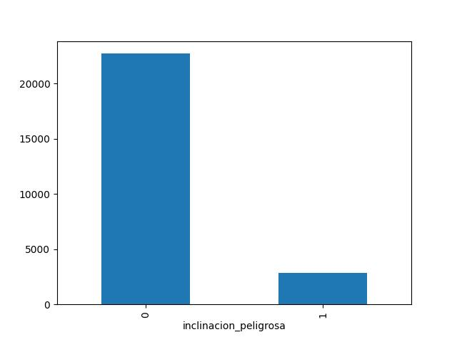
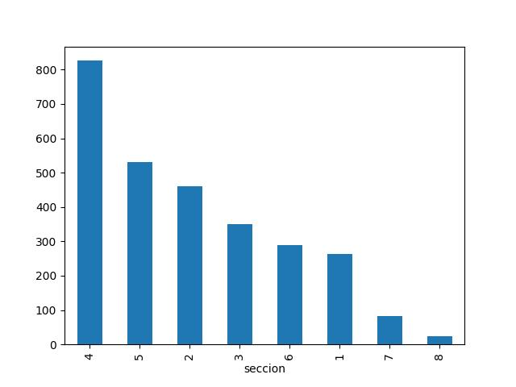
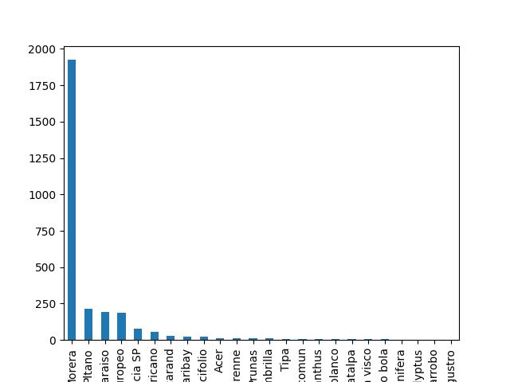
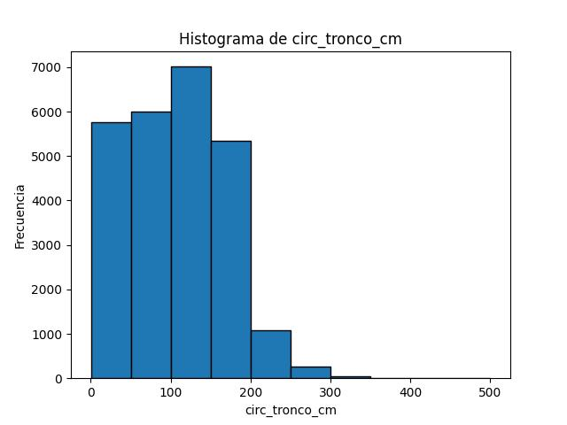
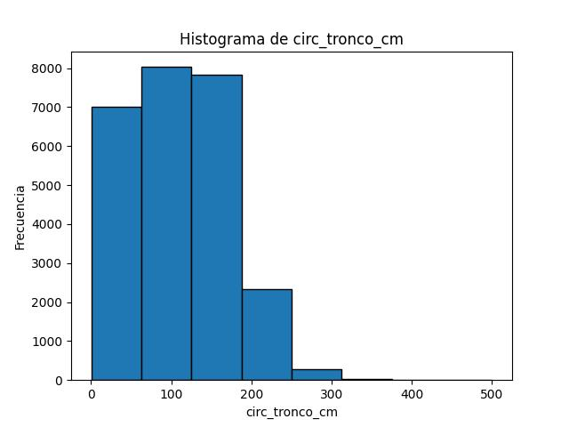
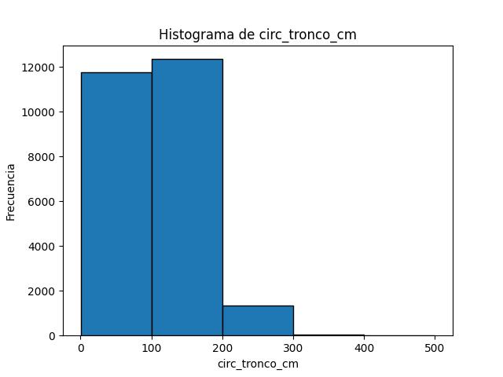
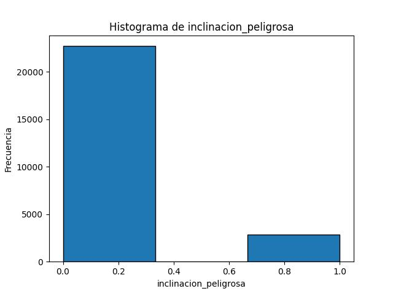

# UNCuyo - Inteligencia Artificial I - 2023
## Trabajo Práctico 7 - Machine Learning

## Parte A

### 2. A partir del archivo arbolado-mendoza-dataset-train.csv responder las siguientes preguntas:

- a. Cual es la distribución de las clase inclinacion_peligrosa?

La distribución de la clase inclinación peligrosa es: 0 = 22700, 1 = 2829

- b. ¿Se puede considerar alguna sección más peligrosa que otra?

La sección 4 puede ser considerada peligrosa debido a que tiene la mayor cantidad de árboles con inclinación peligrosa.

- c. ¿Se puede considerar alguna especie más peligrosa que otra?

La especie Morera tiene la mayor cantidad de árboles con inclinación peligrosa.

### 3. A partir del archivo arbolado-mendoza-dataset-train.csv,

- b. Generar un histograma de frecuencia para la variable circ_tronco_cm. Probar con diferentes números de bins.

Histograma de frecuencia para la variable circ_tronco_cm:

Histograma de frecuencia con bin 10:

Histograma de frecuencia con bin 8:

Histograma de frecuencia con bin 5:

- c. Repetir el punto b) pero separando por la clase de la variable inclinación_peligrosa?

Histograma de frecuencia para la variable inclinacion_peligrosa:

- d Criterios de corte:

bins = [0, 80, 180, 240, 500]

Se decidió que si el diametro del tronco se encontraba entre 0 y 80, su categoría sería "bajo",

Si se encuentra entre 80 y 180, sería "medio",

Si se encuentra entre 180 y 240, sería "alto" y

Si se encuentra entre 240 y 500, sería "muy alto".
